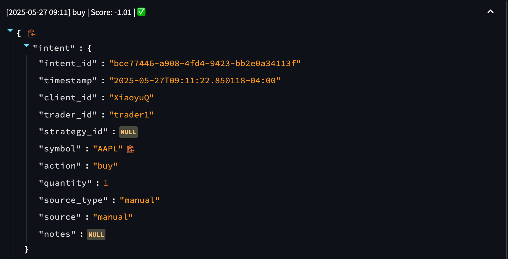
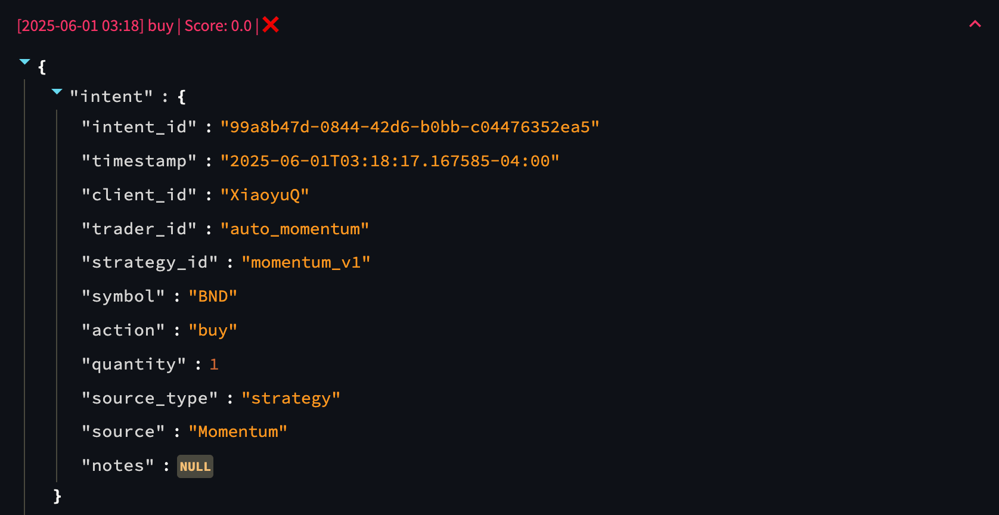
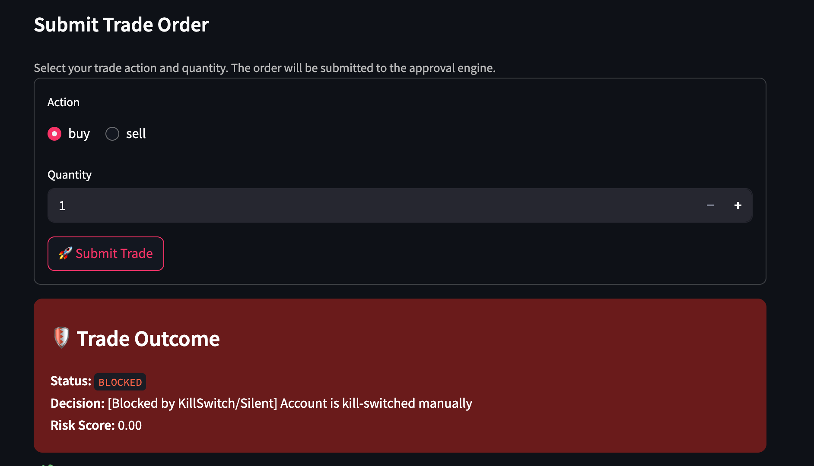

# 🔁 `01_unified_trade_flow.md` — Unified Trade Flow Reference

This document explains the unified intent lifecycle in **XQRiskCore**, with real examples of how manual and strategy-based trades are routed through the system.  
Every trade — regardless of origin — must pass the same structured pipeline, enabling consistent risk control, auditability, and enforcement.

---

## 🧩 Why Unify All Trade Sources?

In traditional systems, manual trades, strategy signals, and rebalancers often use different approval paths or skip governance entirely.

XQRiskCore takes the opposite stance:

> 💡 “A trade is a trade. No matter where it comes from — it must pass through the same discipline.”

All trade actions in XQRiskCore are encapsulated as a `TradeIntent` object.

```text
→ Intent → PreCheck → Risk Signal → Approval → Execution → Audit
```
### 📊 Figure: XQRiskCore Full Trade Lifecycle
This diagram shows the lifecycle of every trade inside XQRiskCore.  
From `TradeIntent` submission (left) to final audit and post-trade update (right), every action is structured, reviewed, and logged.

 
---

## ✅ Design Pattern: TradeIntent

### Example 1: Manual Trade

#### 🔹 Intent Metadata



#### 🧾 TradeIntent Field Reference (Manual-Triggered)

| Field         | Meaning                                                                                                 |
| ------------- | ------------------------------------------------------------------------------------------------------- |
| `intent_id`   | Unique identifier for this trade intent. Used to trace approval, execution, and audit outcomes.         |
| `timestamp`   | UTC timestamp when the intent was submitted. In this case, May 27, 2025 at 09:11 AM (New York time).    |
| `client_id`   | The portfolio owner initiating the trade — here, the client is `XiaoyuQ`.                               |
| `trader_id`   | The user who submitted the intent. `trader1` is a human user operating from the trader UI.              |
| `symbol`      | Target asset: `AAPL` (Apple Inc.).                                                                      |
| `action`      | Trade direction: `buy` (indicating a purchase order).                                                   |
| `quantity`    | Size of the trade: 1 share.                                                                             |
| `source_type` | Indicates how the trade was initiated. `manual` means it came from a UI form.                           |
| `source`      | Repeats the source for clarity: `manual`. (Could differ from `source_type` for strategy-based trades.)  |


### Example 2: Strategy Trade

#### 🔹 Intent Metadata


#### 🧾 TradeIntent Field Reference (Strategy-Triggered)

| Field          | Meaning                                                                                                   |
|----------------|-----------------------------------------------------------------------------------------------------------|
| `intent_id`    | Unique identifier for this trade intent. Used for full traceability in approval, execution, and auditing. |
| `timestamp`    | UTC timestamp when the intent was generated — here, June 1, 2025 at 03:18 AM (New York time).             |
| `client_id`    | The portfolio or account owner associated with the trade — in this case, `XiaoyuQ`.                       |
| `trader_id`    | The automated agent or system that submitted the trade — `auto_momentum` represents a bot or script.      |
| `strategy_id`  | The strategy logic that triggered the trade — here it's `momentum_v1`, suggesting a momentum-based logic. |
| `symbol`       | The asset being targeted: `BND` (Vanguard Total Bond Market ETF).                                         |
| `action`       | The trade direction: `buy` (the strategy is initiating a purchase).                                       |
| `quantity`     | Trade size: 1 unit of the asset.                                                                          |
| `source_type`  | Indicates that this trade originated from a strategy rather than a manual form — value is `strategy`.     |
| `source`       | Strategy name or alias: `Momentum`. May be shown in UI or logs for attribution clarity.                   |

---

## ✅ Design Pattern: Pre-Block — Kill Switch & Silent Mode

XQRiskCore enforces **early-stage trade blocking** via a dual-layer safeguard system — combining **account-level** and **asset-level** constraints.

These checks run **before any trade reaches the approval engine**, ensuring prohibited trades are halted immediately — but still produce full audit trails.

---

### 🔒 Pre-Block Enforcement Logic

| Level             | Type                     | Trigger Example                        | Action        |
|------------------|--------------------------|----------------------------------------|---------------|
| **Account-Level**| Kill Switch (manual/auto)| Admin emergency toggle or EOD trigger  | Block trade   |
| **Account-Level**| Silent Mode              | 3 losing days → enter cooldown         | Block trade   |
| **Asset-Level**  | Kill Switch (manual/auto)| 3-day drawdown > threshold             | Block trade   |
| **Asset-Level**  | Silent Mode              | Recent trade → cooling-off enforced    | Block trade   |

If any of the above are triggered, the trade is stopped _immediately_ —  
**never reaching the risk model, approval logic, or execution layer**.

---

### 📦 But Still Logged

Even blocked trades are:
- ✅ Wrapped in an `ExecutionContext`
- ✅ Given a `status = "blocked"`
- ✅ Tagged with `reason` + optional `rejection_code`
- ✅ Logged to audit trail (`JSONL` + UI)
- ✅ Forwarded back to strategy engine (if applicable)

This ensures **full traceability** even for failed or rejected attempts.

---

### 🧾 Example: Pre-Blocked Manual Trade (Kill Switch)



```json
{
  "intent": {
    "intent_id": "0bf26db9-5cf6-474e-8a08-a7da3b9a489e",
    "timestamp": "2025-06-07T23:30:11.072106-04:00",
    "client_id": "XiaoyuQ",
    "trader_id": "admin",
    "strategy_id": null,
    "symbol": "BND",
    "action": "buy",
    "quantity": 1,
    "source_type": "manual",
    "source": "manual",
    "notes": null
  },
  "approval": {
    "time": "2025-06-07T23:30:11.072106-04:00",
    "approved": null,
    "risk_style": "aggressive",
    "reason": "[Blocked by KillSwitch/Silent] Account is kill-switched manually",
    "reason_code": "SILENT_MODE",
    "score": 0,
    "signals": {
      "regime": "Neutral",
      "volatility": 0,
      "var": 0,
      "cvar": 0,
      "score": 0
    }
  },
  "execution": {
    "status": "blocked",
    "status_code": "REJ_SILENT_MODE",
    "price": null,
    "expected_price": null,
    "price_time": null,
    "slippage_pct": -100,
    "execution_latency_ms": null,
    "commission": 0
  },
  "execution_context": {
    "dry_run": true,
    "broker": "alpaca"
  }
}
```

## ✅ Design Pattern: Risk Approval Engine

Once a trade passes the **Pre-Block stage** (Kill Switch & Silent Mode), it enters the **Risk Approval Engine**.  
This engine evaluates whether the trade is safe, justified, and aligned with the client’s configured risk style.

---

### 🔁 Approval Flow Diagram

```text
          ┌──────────────────┐
          │ TradeIntent      │
          └────────┬─────────┘
                   ▼
        ┌────────────────────────────┐
        │ Is this a SELL action?     │
        └───────┬─────────────▲──────┘
                ▼             │
      ┌────────────────┐      │
      │ Check holdings │      │
      └─────┬──────────┘      │
            ▼                 │
   ┌──────────────┐     ┌──────────────┐
   │ Enough shares│     │ Not enough   │
   │ → Approve    │     │ → Reject     │
   └──────────────┘     └──────────────┘

                   ▼ (If BUY)
       ┌────────────────────────────┐
       │ Fetch price + estimate cost│
       └───────┬────────────────────┘
               ▼
       ┌────────────────────────────┐
       │ Enough cash?               │
       └───────┬───────────────┬────┘
               ▼               ▼
          Fetch signals     Reject trade

               ▼
         Evaluate:
         - score
         - volatility
         - VaR

               ▼
          Decision:
          APPROVE / LIMIT / REJECT

               ▼
       Generate approval response
```


### 🔁 Approval Flow Breakdown

| **Step** | **Purpose**                                      | **Logic Summary**                                                                                       | **Outcome**                          |
|----------|--------------------------------------------------|----------------------------------------------------------------------------------------------------------|--------------------------------------|
| 0        | Sell intent special case                         | - If selling more than held → ❌ Reject <br> - Else → ✅ Auto-approve as de-risking                       | Fast-tracked decision for sell       |
| 1        | Market price & capital check                     | - Fetch price <br> - Estimate cost (with 5% buffer) <br> - Compare to available cash                     | ❌ Reject if underfunded             |
| 2        | Extract signals                                  | Get `score`, `volatility`, `VaR` from `RiskSignalSet` (based on latest metrics)                          | Prepare for step 3                   |
| 3        | Apply thresholds & interpret signals             | - Thresholds vary by `risk_style` (conservative/moderate/aggressive) <br> - Rule logic applied below ↓   | Decision logic determined here       |
| 4        | Output approval structure                        | Populate approval dictionary with result, reason, rejection code, and signals                           | Attach to `intent.approval`          |

---

### 📊 Step 3: Signal Threshold Logic

| **Signal**      | **Comparison Logic**                                                                                   |
|------------------|--------------------------------------------------------------------------------------------------------|
| `volatility`     | ❌ Reject if it exceeds threshold defined by `risk_style`                                              |
| `VaR`            | ❌ Reject if it breaches downside loss limit for `risk_style`                                          |
| `score`          | <ul><li> ≥ 1.0 → ✅ Approve, suggest **expand position**</li><li> 0 to <1.0 → ✅ Approve, hold size</li><li>-0.8 to <0.0 → ⚠️ Limit, suggest reduce size</li><li> < -0.8 → ❌ Reject outright</li></ul> |


### Example: Approved Trade
✅ Example: Approved Trade
```json
{
  "approved": true,
  "reason": "Risk style: aggressive. Score: 0.83. Action: APPROVE. Sizing: maintain current exposure. Reasons: None",
  "rejection_code": null,
  "sizing": "maintain current exposure",
  "signals": {
    "score": 0.83,
    "volatility": 0.026,
    "var": -0.038
  }
}
```

❌ Example: Rejected Trade
```json
{
  "approved": false,
  "reason": "Risk style: conservative. Score: -1.21. Action: REJECT. Sizing: risk too high — trade blocked. Reasons: Score below -0.8 indicates unacceptable risk; Volatility 0.045 exceeds 0.020 for conservative style.",
  "rejection_code": "LOW_SCORE",
  "sizing": "risk too high — trade blocked",
  "signals": {
    "score": -1.21,
    "volatility": 0.045,
    "var": -0.062
  }
}
```

## `core/execution/` — Execution Layer Overview

This module handles **the full execution lifecycle** of all trades in XQRiskCore, from approval validation to portfolio updates and audit logging. It is fully modular, broker-agnostic, and supports both simulated and live trading.

---

### ⚙️ Core Design Pattern

Every approved trade passes through a unified pipeline:

```text
TradeIntent + RiskSignalSet
          ↓
  → ExecutionContext
          ↓
  → BaseExecutor.execute()
          ↓
  → ExecutionGuard.validate_intent(...)
          ↓
  → _run_execution() ← [Manual | Strategy | System]
          ↓
  → [DryRunExecutor | LiveOrderExecutor]
          ↓
  → Portfolio updates, TradeManager logging, Audit trails
```

---

# `audit/` — Structured Audit & Behavioral Logging

The `audit/` module provides **institutional-grade traceability** for all actions taken within XQRiskCore.  
Every trade, strategy execution, and user interaction is **logged, timestamped, and context-tagged** — enabling full forensic reconstruction of decision chains.

---

## 📦 Core Components

### 1. `audit_logger.py` — Trade Audit Logger

Records all trade lifecycle events via:

```python
record_trade_event(
    intent,       # TradeIntent
    approval,     # Approval payload (approved/reason/etc.)
    execution,    # Execution result (price/slippage/latency/etc.)
    context       # ClientContext
)
```


---

## ✅ Example: Approved Trade (Simulated Execution)

Even when a trade **succeeds**, XQRiskCore logs **every detail** for audit, analysis, and future diagnostics.  
Below is a real example of a **manual trade** initiated by a human trader in **dry run mode** — fully recorded.

### 🔹 Trade Snapshot


### 🔹 Logged Execution Record

```json
{
  "intent": {
    "intent_id": "e6798a07-1fbc-4085-93fd-2224d6bd1677",
    "timestamp": "2025-05-20T01:47:46.947901-04:00",
    "client_id": "JerryY",
    "trader_id": "trader1",
    "symbol": "AAPL",
    "action": "buy",
    "quantity": 100,
    "source_type": "manual",
    "source": "manual"
  },
  "approval": {
    "approved": true,
    "risk_style": "moderate",
    "reason": "Simulated execution (dry run)",
    "reason_code": "DRY_RUN",
    "score": -0.91,
    "signals": {
      "regime": "Neutral",
      "volatility": 0.02598,
      "var": -0.0511,
      "cvar": -0.0746,
      "score": -0.91
    }
  },
  "execution": {
    "status": "executed",
    "status_code": "EXEC_OK",
    "price": 208.9587,
    "price_time": "2025-05-19T15:59:59.436Z",
    "slippage_pct": 0.001,
    "execution_latency_ms": 5,
    "commission": 0
  },
  "execution_context": {
    "dry_run": true,
    "broker": "alpaca"
  },
  "executor_type": "DryRunExecutor",
  "portfolio_snapshot": {
    "capital": 979083.23,
    "net_value": 999958.23,
    "assets": {
      "AAPL": {
        "position": 100,
        "avg_price": 209.1677,
        "current_price": 208.75,
        "drawdown_pct": -0.001997,
        "holding_days": 1,
        "silent_days_left": 0,
        "last_slippage_pct": 0.1
      }
    }
  },
  "risk_event_flags": {
    "cooling_off_triggered": false,
    "killswitch_triggered": false
  },
  "system_version": "v1.0.0"
}
```

---

### 🧠 What This Tells Us

| **Category**         | **Insight**                                                                 |
|----------------------|-----------------------------------------------------------------------------|
| **Intent Metadata**  | Trader `trader1` submitted a buy order for 100 shares of `AAPL`.            |
| **Approval Layer**   | Risk score was **-0.91**, which is below normal, but **approved** under `dry_run` mode due to testing configuration. |
| **Execution Layer**  | Simulated price was `$208.96`, with **0.1% slippage** and **5ms latency**. |
| **Portfolio Impact** | The trade updated the portfolio with 100 AAPL shares and adjusted net value and drawdown. |
| **Safety Flags**     | Neither **KillSwitch** nor **Cooling-Off** triggers were active — trade passed all safety gates. |

---

✅ **Key Takeaway**  
Even in dry-run mode, XQRiskCore captures:

- Exact price, latency, slippage  
- Risk signal values (score, VaR, CVaR, volatility)  
- Approval reasons and decision logic  
- Post-trade position and capital metrics  
- Risk trigger statuses (e.g., KillSwitch)

📌 Whether **approved**, **rejected**, or **blocked**,  
**every trade attempt is fully traceable and auditable**.


