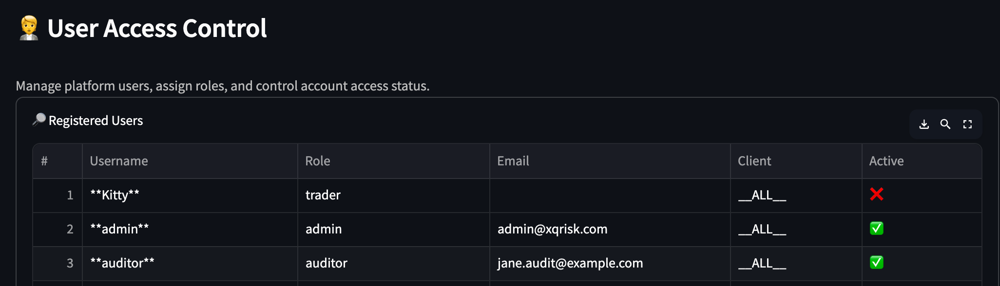
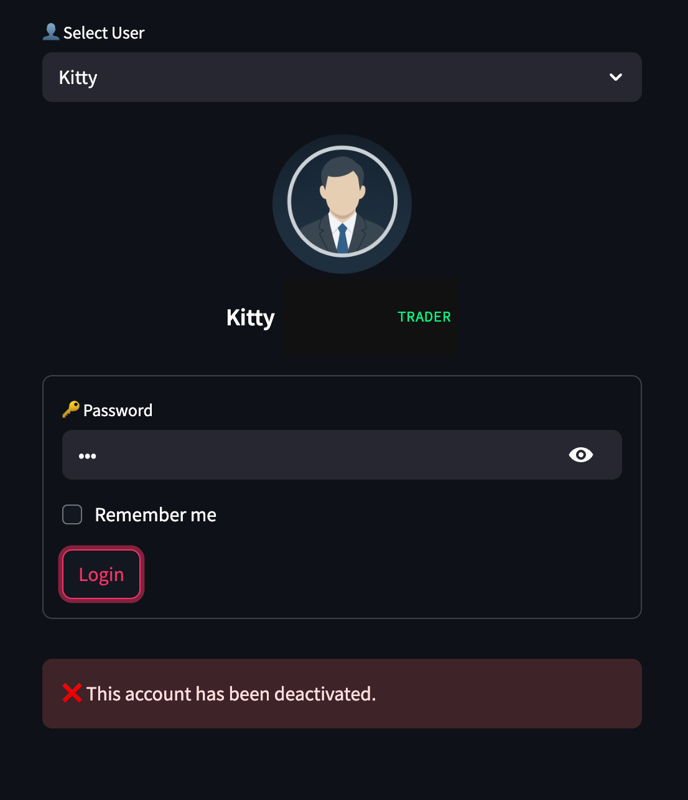
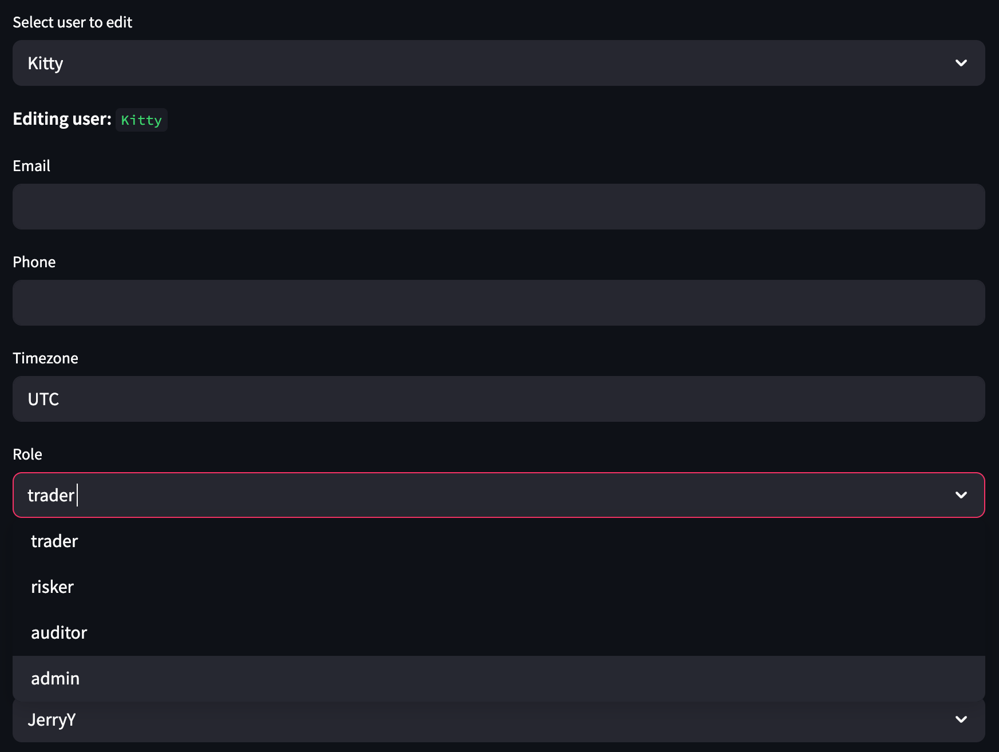
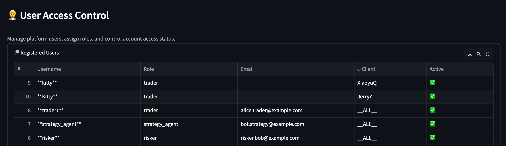
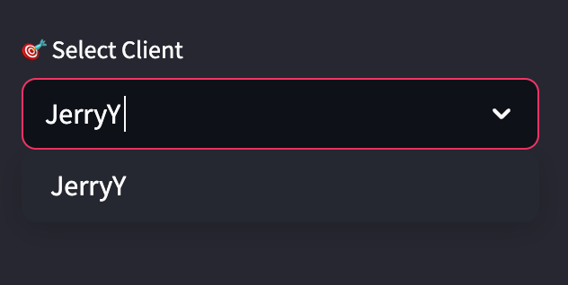
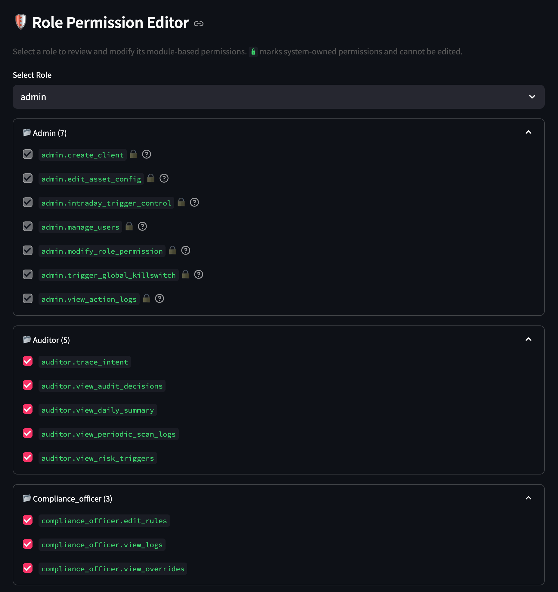
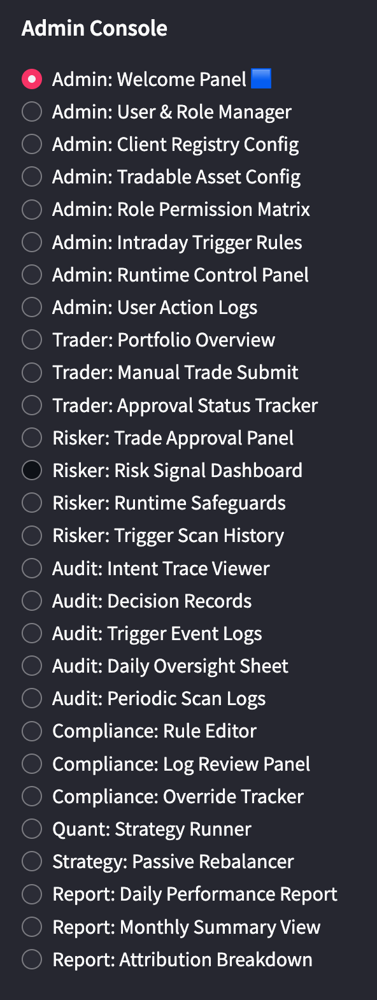
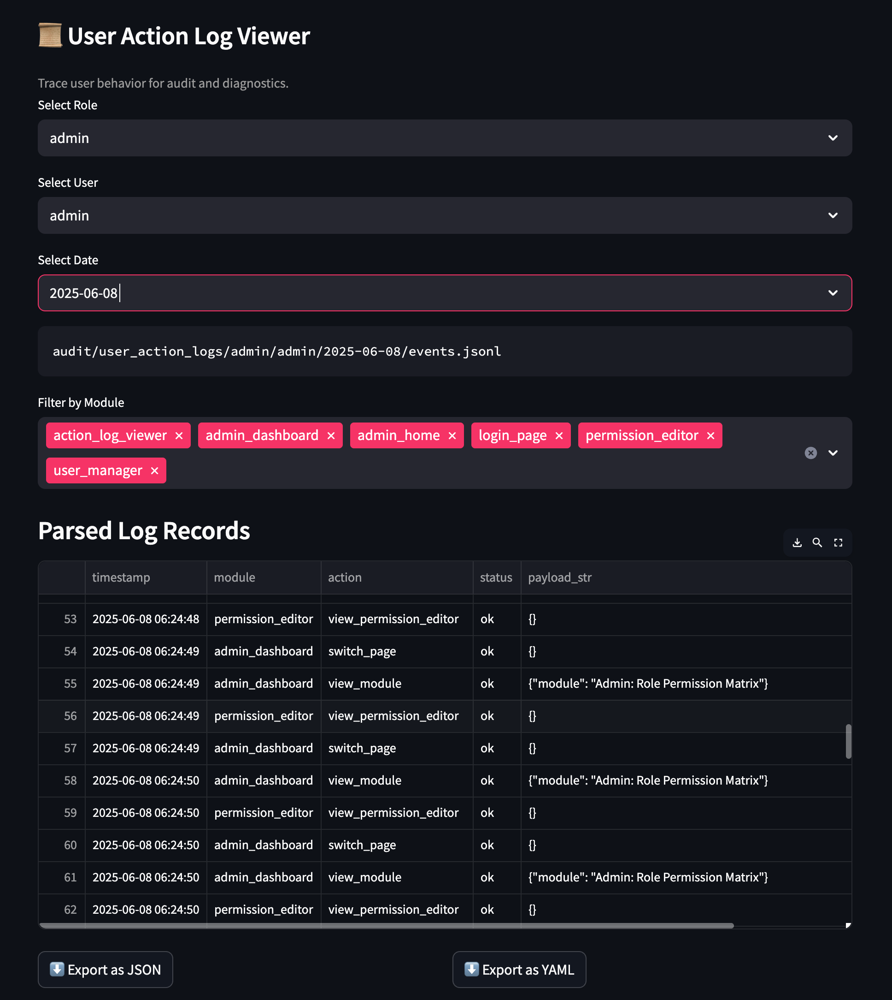
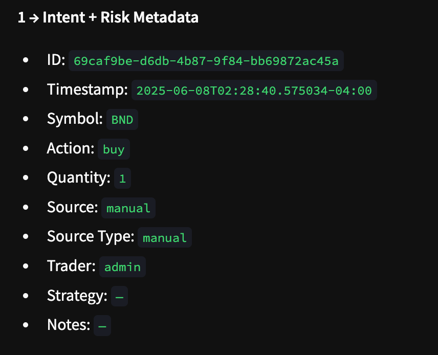
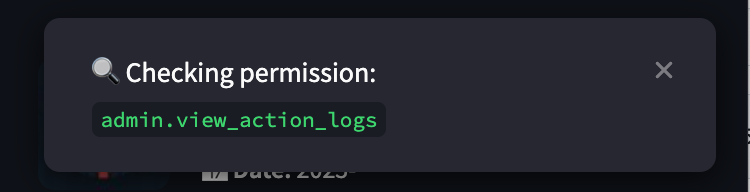

# XQRiskCore - RBAC (Role-Based Access Control) User Guide

XQRiskCore's RBAC system is engineered to meet the stringent demands of the financial industry, prioritizing **institutional-grade security, flexibility, and auditability.**

---

## 🧱 Core Principles: Wall Street-Grade Access Control

XQRiskCore’s RBAC system enforces institutional discipline through four core principles:

### 1. 🔍 Immutable Audit Trails  
All user actions are permanently logged and tamper-proof — ensuring accountability, regulatory traceability, and post-event forensics.

### 2. ⚡ Real-Time, Flexible Permissions  
Roles and permissions can be updated instantly without downtime, enabling agile responses to evolving business or compliance demands.

### 3. 🔐 Granular Control & Segmentation  
Fine-grained access at the operation level, with strict client isolation. Enforces **Least Privilege** and **Separation of Duties** by design.

### 4. ✅ Compliance by Architecture  
Built to meet global standards (SOX, MiFID II, GDPR), ensuring that every action is demonstrably compliant — by default, not exception.

---

## RBAC Features & Examples

### 1. User & Role Management

The system supports user activation, deactivation, and comprehensive management, strictly adhering to role assignment principles.

* **Admin Can Activate/Deactivate Users:** Administrators have the authority to set users as `inactive` or reactivate them. This provides essential account lifecycle management and security control.

    

* **System User List:** The system clearly displays the status and assigned roles for all users.

    

---

### 2. Role Modifiability

The system empowers administrators with the flexibility to adjust roles, adapting to evolving business needs.

* **Dynamic Role Permission Adjustment:** Existing roles (e.g., `Risker`, `Trader`, `Auditor`) can have their names and associated permissions modified dynamically, without requiring redeployment.

    

---

### 3. Fine-Grained Client Segmentation

The RBAC system supports linking specific clients to authorized roles, ensuring robust data isolation and clear segregation of duties.

* **Admin-Set Client Permissions:** Only clients configured by an administrator (e.g., `JerryY` in the example) can be assigned to a specific account manager role.

    

* **Selectable Clients Under Current Account:** Users can only view and select clients pre-configured by an administrator, within the scope of their currently authorized account.

    

---

### 4. Real-time Permissions & Immutable Audits

This is a cornerstone of our RBAC system, ensuring both extreme flexibility and rigorous audit trails.

* **Hot-Swappable Role Permissions:** Permission changes take effect **in real-time**, eliminating the need for service restarts and ensuring system agility in response to market shifts.
  
    

* **Flexible Permission Assignment:** `admin` or any other role can be granted any combination of permissions, including all permissions, to meet specific operational requirements.

    

* **Mandatory Audit Logging:** All user actions and view operations are **faithfully and immutably recorded** by the system. This is critical for post-facto traceability and accountability, meeting the highest audit standards in the financial industry.

    
    
* **Precise Attribution for Temporary Permissions:** Even if an `admin` or another role temporarily gains permission to `place order`, the `trader` field within the `intent` will **faithfully record the actual operating username** (e.g., `admin`) and cannot be modified. This resolves accountability issues for elevated privileges and prevents "invisible" operations.

    

---

### 5. Continuous Activity & Permission Review

The system performs permission checks and records actions at every critical point within the user's operational path.

* **Permission Review on UI Navigation:** Each time a user navigates between interfaces, the system conducts a real-time permission review and logs the activity. This ensures immediate permission validity and provides a comprehensive audit trail for every user interaction.

    

---

