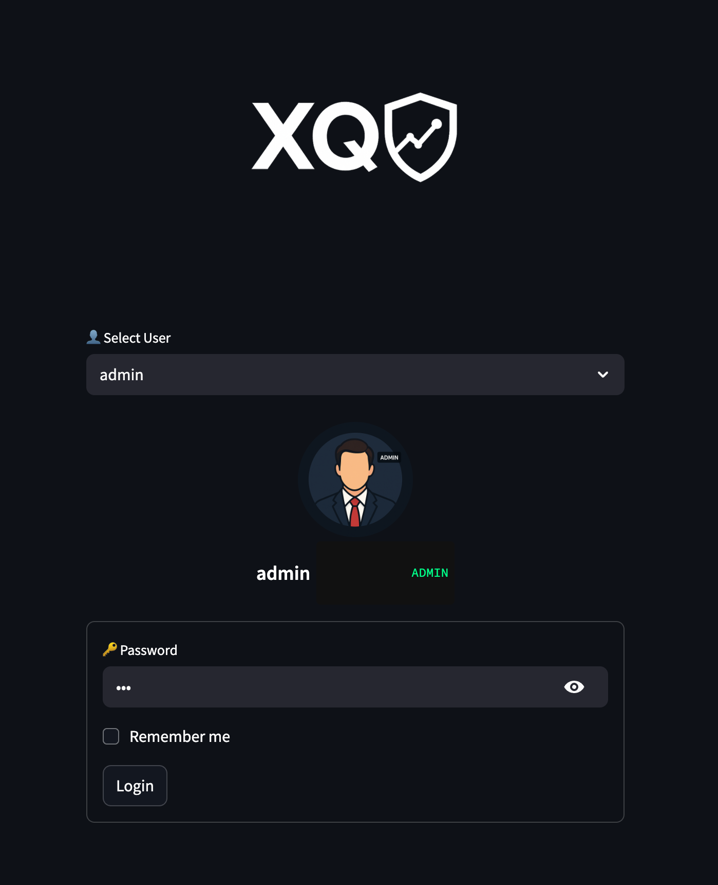
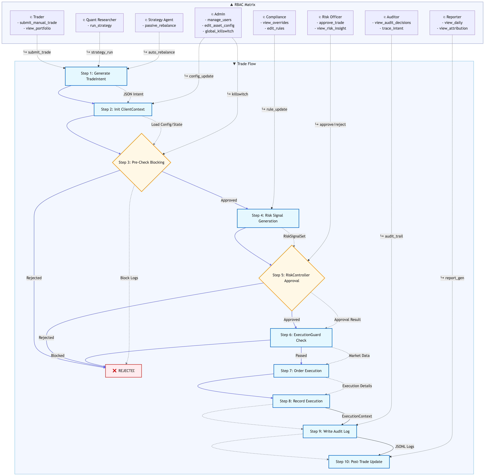
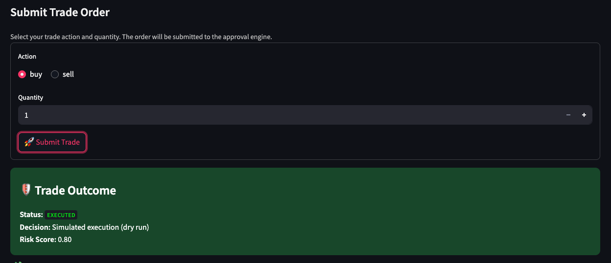
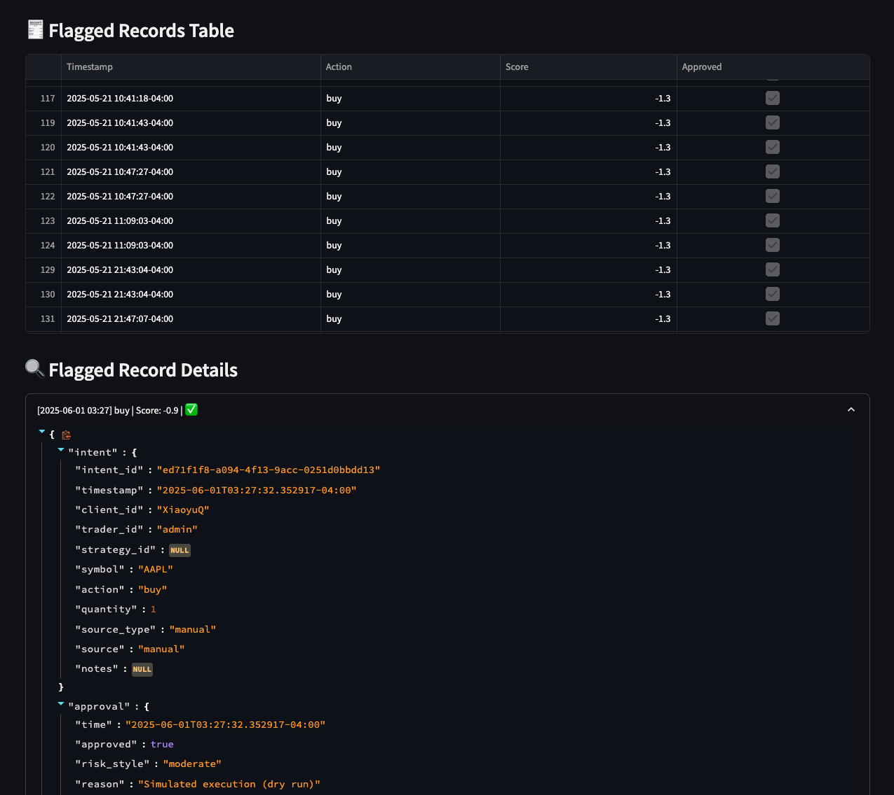
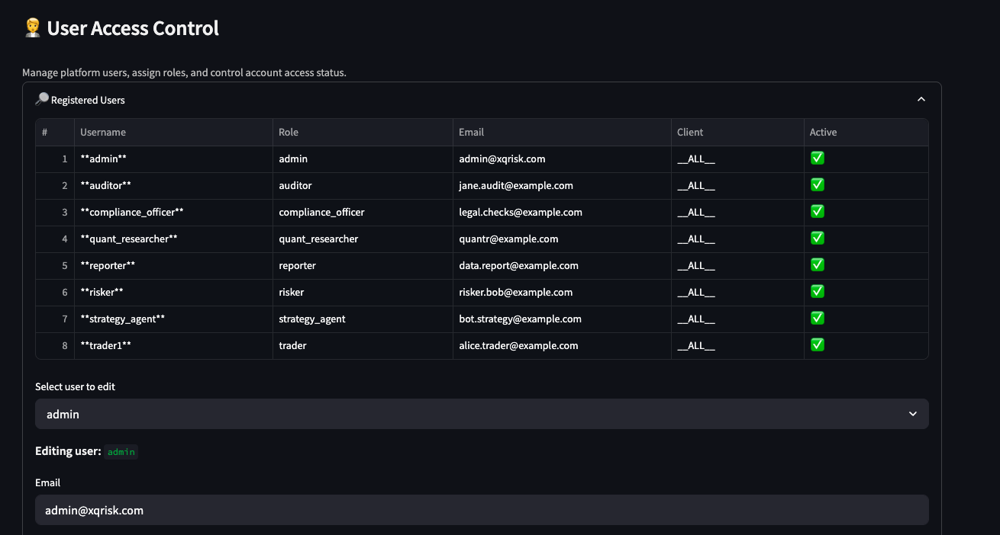
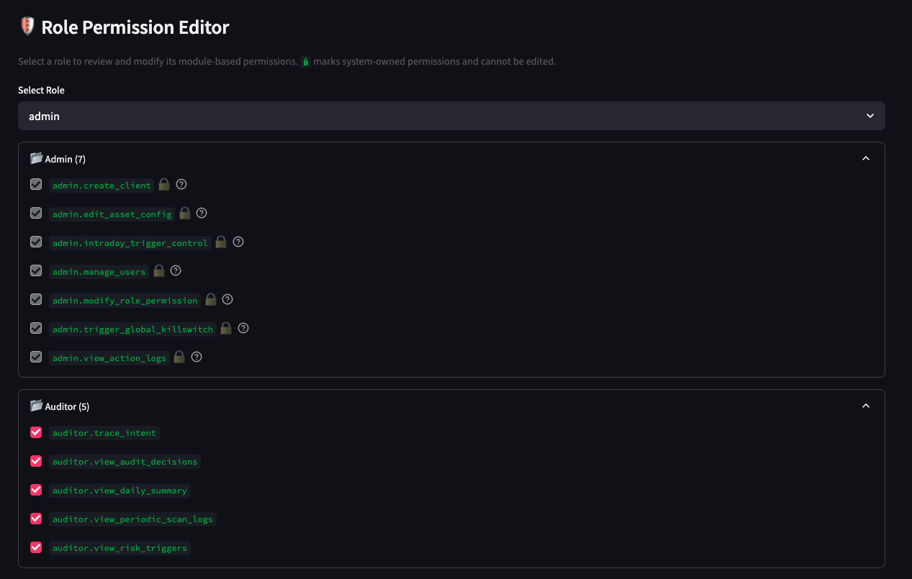
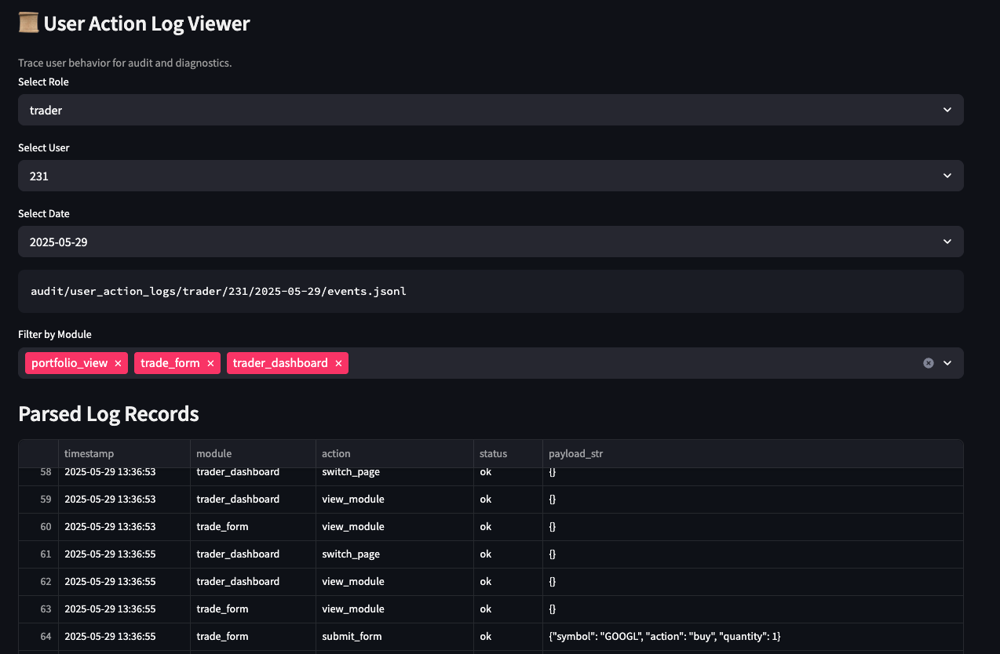

# XQRiskCore

> **A governance-grade risk control engine for trading** — with unified trade approval, structured audit logging, role-based access control, and multi-layer enforcement.

---

🚀 Jump in as an admin, trader, or auditor — no setup required.  
🎯 Live Demo → [xqriskcore-production.up.railway.app](https://xqriskcore-production.up.railway.app)

<p align="center">
  
</p>

*Deployed on Railway. Optimized for responsiveness, audit visibility, and governance transparency.*

---

## ⚙️ Built to Govern, Not Just Execute

**XQRiskCore** enforces policy before trades happen — not after they go wrong.

Every trade is routed through a structured lifecycle:
- ⛓️ From submission to approval  
- 🧾 From scoring to audit logging  
- 🛡️ From detection to multi-layer safeguards

Whether triggered by a trader, a strategy, or a rebalance engine —  
**every action is accountable, every override is recorded, and every permission is scoped.**

> **This is not order routing. It’s responsibility routing.**

---

## 📑 Table of Contents

- [🧭 System Origins & Design Philosophy](#-system-origins--design-philosophy)
- [📚 Institutional Inspirations](#-institutional-inspirations)
- [✅ Core Capabilities](#-core-capabilities)
  - [🔁 Unified Trade Flow](#-unified-trade-flow)
  - [🧠 Dual-Path Risk Control](#-dual-path-risk-control)
  - [🧱 Role-Based Governance (RBAC)](#-role-based-governance-rbac)
  - [🧾 Structured Behavioral Logging](#-structured-behavioral-logging)
- [🛡️ Emergency Guard Layer](#-emergency-guard-layer)
- [🧩 System Architecture](#-system-architecture)
- [🔌 Service Interface Abstraction](#-service-interface-abstraction)
- [🧮 Functional Overview](#-functional-overview)
- [📌 Use Cases](#-use-cases)
- [🚧 Roadmap & Evolution](#-roadmap--evolution)
- [🌱 Evolution by Design](#-evolution-by-design)
- [🧬 Who Am I?](#-who-am-i)
- [🤝 Collaboration & Opportunities](#-collaboration--opportunities)
- [🙏 Acknowledgments](#-acknowledgments)
- [📄 License](#-license)
- [📬 Contact](#-contact)

---

## 🧭 System Origins & Design Philosophy

**XQRiskCore wasn’t built to imitate trading tools — it was architected to enforce institutional-grade governance.**

As a solo developer with a background in statistical modeling and financial risk, I built XQRiskCore from first principles — not as a strategy sandbox, but as a system of control.

Its design foundations are:

- To **embed compliance** directly into the trading process  
- To **log structured decisions**, not just outcomes  
- To **restrict permissions** based on role and scope  
- To **monitor risk continuously**, not retroactively

What sets XQRiskCore apart is clarity: every decision is traceable, every rule is testable, and every action is governed by policy.

---

🎧 **Want to hear what a system of discipline sounds like?**  
Listen to the official theme track — composed by AI, inspired by structure:

> 🔊 [Watch: The Core — Theme of XQRiskCore](https://youtu.be/OsUe84mkLhg)

Let the music carry the logic.  
**Structured. Watchful. Unyielding.**


---

## 📚 Institutional Inspirations

While XQRiskCore is independently built, its architecture is inspired by world-class risk systems:

✅ *Landed in v1.0 (beta):*  
- **BlackRock Aladdin** — Unified trade flow + Role-based governance and audit attribution  
- **J.P. Morgan Vega / RaaS** — Dual-path risk enforcement (pre/post trade)  
- **Goldman Sachs Marquee** — Structured action logging and behavioral traceability  

🧪 *Planned in future iterations:*  
- **Beacon / Vega** — Rule hot-swapping, version control for risk policies  
- **Bridgewater / Two Sigma** — Adaptive scoring and self-tuning risk logic

---

## ✅ Core Capabilities

### 1. 🔁 Unified Trade Flow — One Pipe for All Trades

Unlike most systems that separate manual, strategy, and rebalance trades,  
**XQRiskCore unifies them into a single pipeline** — one that enforces **the same approval logic**, **risk checks**, and **audit trace**.

No trade escapes the flow.  
Every source — whether it’s a button click, a strategy trigger, or a scheduled rebalance — must go through:

→ Intent → Risk Signal → Approval → Execution → Audit → Post-Trade Monitoring

#### 📊 Figure 1: XQRiskCore Risk-Controlled Trade Lifecycle


🧩 Want to understand how this unified trade pipeline actually works under the hood?

📄 [See `01_unified_trade_flow.md`](01_unified_trade_flow.md)

Included:

- 🎯 The philosophy behind `TradeIntent` — “a trade is a trade, regardless of source”
- 📦 Side-by-side examples of manual vs strategy-generated intents
- 🔒 How pre-block mechanisms (Kill Switch, Silent Mode) intercept trades before execution
- ✅ How the Risk Approval Engine evaluates score, volatility, and VaR
- 📊 Full trade lifecycle from intent → approval → execution → audit
- 🧠 How this structure ensures **policy consistency**, **traceability**, and **enforceable compliance**

---

### 2. 🧠 Dual-Path Risk Control Architecture

XQRiskCore enforces risk across two complementary paths:

#### 1️⃣ Pre-Trade Approval

Every trade — whether triggered manually, algorithmically, or via rebalancing — must pass a unified approval gate  
before it is executed. This is the core of XQRiskCore’s institutional-grade risk governance.

##### 🔁 Approval Flow Diagram

```text
          ┌──────────────────┐
          │ TradeIntent      │
          └────────┬─────────┘
                   ▼
        ┌────────────────────────────┐
        │ Is this a SELL action?     │
        └───────┬─────────────▲──────┘
                ▼             │
      ┌────────────────┐      │
      │ Check holdings │      │
      └─────┬──────────┘      │
            ▼                 │
   ┌──────────────┐     ┌──────────────┐
   │ Enough shares│     │ Not enough   │
   │ → Approve    │     │ → Reject     │
   └──────────────┘     └──────────────┘

                   ▼ (If BUY)
       ┌────────────────────────────┐
       │ Fetch price + estimate cost│
       └───────┬────────────────────┘
               ▼
       ┌────────────────────────────┐
       │ Enough cash?               │
       └───────┬───────────────┬────┘
               ▼               ▼
          Fetch signals     Reject trade

               ▼
         Evaluate:
         - score
         - volatility
         - VaR

               ▼
          Decision:
          APPROVE / LIMIT / REJECT

               ▼
       Generate approval response
```

Try it:
- 👉 [**Login as `trader1` (Role: Trader)**](https://xqriskcore-production.up.railway.app)  
  → Go to **`Trader: Manual Trade Submit`**
  
  → Select a client and submit a trade form to trigger the full risk approval flow.
- 👉 [**Login as `quant_researcher` (Role: Quant Researcher)**](https://xqriskcore-production.up.railway.app)  
  → Activate a strategy and observe how it routes through the same unified trade lifecycle.


- 👉 [**Login as `auditor` (Role: Auditor)**](https://xqriskcore-production.up.railway.app)  
  → Go to **`Audit: Decision Records`**  
  → Review detailed decision records, including approvals, rejections, risk scores, and override flags.


---

#### 🧯 2️⃣ Post-Trade Monitoring — Risk Trigger System

After a trade is approved and executed, XQRiskCore continuously monitors live positions using two layered engines:

- ⚡ **IntradayTriggerEngine** — Real-time monitoring during market hours  
- 🌙 **SilentTriggerEngine** — End-of-day (EOD) review to enforce lockouts or cooldowns

If any predefined **account-level** or **asset-level** thresholds are breached, the system will trigger **Silent Mode** (cooldown) or a full **Kill Switch** (lockdown) — ensuring risk is reined in before it spirals.

##### 🧮 Account-Level Risk Triggers

| 🔍 Condition                         | 🧾 Metric Used                  | ⚠️ Action              | 🛠️ Module               |
|-------------------------------------|---------------------------------|-------------------------|--------------------------|
| Intraday drawdown ≤ **-5%**         | `drawdown` vs. `peak_value`     | Silent Mode (2 days)    | IntradayTriggerEngine    |
| Daily return ≤ **-5%**              | `daily_return`                  | Silent Mode (2 days)    | SilentTriggerEngine      |
| Monthly return ≤ **-10%**           | `monthly_return`                | Silent Mode (until EOM) | SilentTriggerEngine      |
| Consecutive losing days ≥ **3**     | `consecutive_losses`            | Silent Mode (1 day)     | SilentTriggerEngine      |

> 💡 These rules act as **portfolio-level brakes**, especially when trader behavior, exposure concentration, or market turmoil cause repeated or compounding losses.

##### 📦 Asset-Level Risk Triggers

| 🔍 Condition                               | 🧾 Metric Used                | 📉 Threshold   | 🧊 Lock Duration | 🛠️ Trigger Module(s)                         |
|-------------------------------------------|-------------------------------|----------------|------------------|------------------------------------------------|
| Position drawdown ≤ **-7%**               | `pos_drawdown`                | -7%            | 3 days           | IntradayTriggerEngine                          |
| 3-day cumulative drawdown ≤ **-10%**      | `drawdown_3d`                 | -10%           | 7 days           | SilentTriggerEngine                            |
| Live drawdown ≤ **-15%**                  | `drawdown_pct`                | -15%           | 7 days           | SilentTriggerEngine                            |
| Consecutive down days ≥ **3**             | `consecutive_down_days`       | 3              | 7 days           | Intraday + SilentTriggerEngine                 |
| Single-day move ≥ **±8%**                 | `(cur - prev) / prev`         | 8%             | 7 days           | Intraday + SilentTriggerEngine                 |
| Most recent slippage ≥ **0.5%**           | `last_slippage_pct`           | 0.5%           | 7 days           | Intraday + SilentTriggerEngine                 |

> 📌 These asset-specific rules prevent **repeat exposure to stressed instruments**, and build in slippage-sensitive protection.

📄 [See `02_intray&&daily_trigger.md`](02_intray&&daily_trigger.md)  
Includes:

- 🛰️ How `IntradayTriggerEngine` detects and blocks live risks during market hours  
- 🌙 How `SilentTriggerEngine` enforces cooldowns and slippage rules after market close  
- 🚦 Dual-stage enforcement design for round-the-clock protection  
- ⚡ Thresholds for drawdown, volatility, slippage, and behavioral anomalies  
- 🔁 Integration with audit logs, manual override, and per-client scan frequency  

##### 🧠 Future Enhancements (Planned)

- **Black Swan Handling**: e.g., S&P500 drops > 5% in one day → system-wide KillSwitch  
- **Slow Burn Alerting**: 5 small losing days without major drops → cumulative risk lockdown  

#### 🧬 Closed-Loop Monitoring Philosophy

> Approve only what deserves to go through.  
> Monitor everything that actually did.

XQRiskCore’s post-trade system turns **reactive logging** into **proactive governance** —  
ensuring that high-risk behavior is not just flagged, but automatically countered with structural circuit breakers.

---

### 3. 🧱 Role-Based Governance (RBAC)

| Functional Domain                            | Assigned Role         | Status         |
|---------------------------------------------|------------------------|----------------|
| ✅ System Configuration & Access Control     | `admin`                | ✅ Implemented |
| ✅ Manual Trade Execution                    | `trader`               | ✅ Implemented |
| ✅ Risk Approval & Rule Enforcement          | `risker`               | ✅ Implemented |
| ✅ Log Auditing & Behavioral Traceability    | `auditor`              | ✅ Implemented |
| ✅ Strategy Research & Factor Optimization   | `quant_researcher`     | ✅ Implemented |
| 🟡 Report Generation & Performance Analysis  | `reporter`             | 🔧 Coming Soon |
| 🟡 Compliance & Manual Risk Intervention     | `compliance_officer`   | 🔧 Coming Soon |
| 🟡 Strategy Signal Execution Agent           | `strategy_agent`       | 🔧 Coming Soon |

Each role is **permission-scoped**, **identity-linked**, and **behavior-tracked**, ensuring clean separation of duties and full accountability.

#### 🔐 Core Principles of Permission & Governance Design

- ✅ **Who can see what** — controls **information leakage risk**  
- ✅ **Who can click which button** — acts as the **final defense** against unauthorized operations  
- ✅ **Who ran a strategy or modified a threshold** — becomes the **accountability chain** when risks surface later  
- ✅ **Permission logs + Action logs** — form the **foundation for compliance reporting** and regulatory clarity  

This governance design ensures that every operation is **traceable, auditable, and justifiable**, reflecting institutional-level discipline in a modular, developer-owned system.

#### 🧑‍💼 Admin Console Highlights

- 👉 [**Login as `admin` (Role: Admin)**](https://xqriskcore-production.up.railway.app)  
  → Go to **`Admin → User & Role Manager`**  
  → Manage clients, assign roles, and activate/deactivate users in a secure, controlled interface.

⬇️ **Client & User Management Interface**  


- 👉 [**Still as `admin`**](https://xqriskcore-production.up.railway.app)  
  → Go to **`Admin → Role Permission Matrix`**  
  → Review and configure role-specific access rights with full visibility.

⬇️ **Permission Control Matrix View**  


📄 [See `03_rbac.md`](03_rbac.md)  
Includes:

- 🛡️ Core principles for Wall Street-grade access control: auditability, flexibility, and compliance  
- 👤 How admins manage users and dynamically assign or revoke roles in real time  
- 🧩 Support for per-client segmentation and granular permission scoping  
- 🔄 Hot-swappable permission changes without system restarts  
- 🧾 Immutable audit logging of all user actions and temporary privilege elevations  
- 🔍 Real-time permission checks during every interface interaction
---

### 4. 🧾 Structured Behavioral Logging

XQRiskCore logs **every user and system action** using structured metadata — forming the foundation for accountability, compliance, and retrospective analysis.

#### 🧩 Action Types Tracked

| Type     | Description                                                | Example                                  |
|----------|------------------------------------------------------------|------------------------------------------|
| `view`   | Passive activity such as opening a dashboard or report     | Viewing a portfolio allocation snapshot  |
| `action` | User-initiated events                                      | Submitting a trade or editing config     |
| `system` | Automated or scheduled system behaviors                    | Daily risk scans or silent mode triggers |


#### 🗂️ File Format & Storage

Logs are written in newline-delimited JSON (`.jsonl`) and stored by user, role, and date for modular audit processing:

```
audit/user_action_logs/{role}/{user_id}/{YYYY-MM-DD}/events.jsonl
```

Each file captures a full day of timestamped, structured event records.

#### 🔍 Inspecting Logs as Admin

- 👉 [**Login as `admin1` (Role: Admin)**](https://xqriskcore-production.up.railway.app)  
  → Go to **`Admin → User Action Logs`**  
  → Explore a structured, role-filtered log viewer that captures everything users **viewed**, **submitted**, **triggered**, or **overrode** — all immutably recorded for audit and accountability.

⬇️ **User Action Log Viewer**  


#### 🧠 Why Logging Matters

A real risk officer doesn’t log for vanity — they log for the **moments that matter**:

- 🕵️ **Regulatory investigations**  
- 🧾 **Internal audits and governance reviews**  
- ⚖️ **Legal evidence in dispute scenarios**  
- 💼 **Accountability to boards, investment committees, or external funders**

Behavioral logs are not just for debugging — they are **defensive assets** in institutional-grade risk governance.

#### 📌 What Each Log Captures

Every action record includes:

- **`user_id`** — who triggered the action  
- **`timestamp`** — when it occurred  
- **`module`** — where it happened in the system  
- **`action`** — what was done (e.g., submitted, rejected)  
- **`status` / `override_flag`** — was it approved, denied, or bypassed  
- **`trace_path`** — which components or roles participated in the decision lifecycle  

These structured records support downstream workflows such as:
- Anomaly detection  
- Compliance reporting  
- Risk override tracebacks  
- Strategy performance attribution  
---

## 🛡️ Emergency Guard Layer

The Emergency Guard Layer serves as XQRiskCore’s final line of defense — enforcing **system stability**, **audit integrity**, and **strategy discipline** under both normal and degraded conditions.

It is designed to **fail safe**, not fail silently.

### ✅ Active Safeguard Modules

| Module                | Description                                                                 | Status    |
|-----------------------|-----------------------------------------------------------------------------|-----------|
| `SystemGuard`         | Blocks trade execution if data feeds, APIs, or core services are unavailable | ✅ Active |
| `StrategyThrottler`   | Temporarily suspends overly frequent or repeatedly failing strategies         | ✅ Active |
| `TradeAuditFailSafe`  | Invalidates trades post-execution if audit logs fail to write                 | ✅ Active |
| `KillSwitchManager`   | Programmatic circuit breaker for locking accounts or specific asset activity | ✅ Active |
| `runtime_controls.py` | Provides a UI-based interface for triggering emergency lockdowns manually     | ✅ Active |

These modules ensure the system remains **governable**, **observable**, and **safe to operate** — even in edge cases where strategy logic, infrastructure, or user behavior becomes unreliable.

📄 [See `04_emergency_guard_layer.md`](04_emergency_guard_layer.md)  
Includes:

- 🛡️ How the Emergency Guard Layer protects against system failure, audit loss, and runaway strategies  
- ⚙️ Descriptions of active modules like `SystemGuard`, `KillSwitchManager`, and `TradeAuditFailSafe`  
- 🔁 Execution lifecycle hooks: pre-trade, post-trade, and override-stage intercepts  
- 🧠 Design rationale for fail-safe logic under degraded or adversarial conditions  
- 🔍 Full-traceability enforcement across manual, strategy, and automated executions  
- 🔒 Planned upgrades: circuit breakers, breach alerting, and privileged override audit mechanisms

---

## 🧩 System Architecture

The system follows a four-layer design:

| Layer Name                   | Role Description                                                                 | Key Modules & Files                                                                                  |
|-----------------------------|-----------------------------------------------------------------------------------|--------------------------------------------------------------------------------------------------------|
| **1. Data & Signal Layer**  | Market data ingestion, portfolio metrics, risk signal generation                 | `market_data/`, `utils/`, `risk_engine/signals/`, `clients/*/snapshots/portfolio_state.json`         |
| **2. Risk Engine & Approval Layer** | Risk scoring, rule enforcement, trade blocking via KillSwitch/Silent Mode        | `risk_engine/`, `risk_engine/signals/`, `clients/*/config/asset_config.yaml`                         |
| **3. Strategy Module Layer**| Trade idea generation via strategies or manual input                             | `strategy/`, `frontend/roles/trader/pages/trade_form.py`, `scheduler/rebalance_scheduler.py`         |
| **4. Execution & Audit Layer** | Trade execution, audit logging, lifecycle traceability                           | `services/trade_flow.py`, `core/execution/`, `audit/`, `clients/*/audit/`, `frontend/roles/auditor/` |


Three context containers coordinate logic:

| Context Object   | Scope of Responsibility                     | Primary Role                                                                  | Where It's Instantiated                         | Represents                          |
|------------------|----------------------------------------------|-------------------------------------------------------------------------------|--------------------------------------------------|-------------------------------------|
| `ClientContext`  | Portfolio state, risk settings, intraday metrics | Encapsulates account-level risk exposure, holdings, drawdowns, constraints    | During every trade intent submission            | **Account’s Real-Time Risk Profile** |
| `ExecutionContext` | Full trade lifecycle (intent → audit)       | Tracks trade from intent, approval, execution, post-trade update to audit log | Central to the `trade_flow.py` pipeline         | **Trade Trace & Audit Container**   |
| `RequestContext` | User identity, permissions, UI session state | Governs user access, page visibility, and logs interactions                   | On login; stored in Streamlit `session_state`   | **UI Session & Access Authority**   |


                 ┌────────────────────────────┐
                 │      RequestContext        │
                 │────────────────────────────│
                 │ user_id                    │
                 │ role → RBAC permissions    │
                 │ session_token              │
                 └────────────▲───────────────┘
                              │
                            Login
                              │
                              ▼
                    ┌──────────────────┐
                    │   TradeIntent     │  ← Manual / Strategy / Auto-Rebalancer
                    └───────┬───────────┘
                            ▼
          ┌────────────────────────────────────┐
          │           ClientContext            │  ← Per-client container
          │────────────────────────────────────│
          │ portfolio_state                    │
          │ risk_profile (from config)         │
          │ intraday risk metrics & triggers   │
          └───────────────┬────────────────────┘
                          ▼
          ┌────────────────────────────────────┐
          │         ExecutionContext           │  ← Full trade lifecycle container
          │────────────────────────────────────│
          │ trade_intent                       │
          │ risk_signals + approval_score      │
          │ execution_result                   │
          │ audit_log (for structured tracking)│
          └────────────────────────────────────┘

---

## 🧩 Service Interface Abstraction

To demonstrate modular engineering capability and support SDK-like integration, core services in **XQRiskCore** have been refactored into interface classes. These interfaces decouple logic from orchestration, enabling independent testing, service injection, and future API exposure.

### ✅ Implemented Service Interfaces

| Interface Class            | Role Description                                  |
|----------------------------|----------------------------------------------------|
| `TradeFlowService`         | Unified trade lifecycle execution interface       |
| `RiskEvaluatorService`     | Risk signal generation and approval logic         |
| `StrategySignalService`    | Strategy-based trade intent generation            |
| `MarketDataService`        | Market price and history access abstraction       |

These classes can be imported and invoked independently, allowing for flexible integration and precise control over each layer:

```python
svc = TradeFlowService(ctx)
result = svc.submit(intent)

risk = RiskEvaluatorService(ctx)
signals = risk.evaluate(intent)

market = MarketDataService()
price = market.get_latest_price("AAPL")
```

---

## 🧮 Functional Overview

**XQRiskCore** is a unified risk governance system that integrates trade routing, approval, control, and audit into a single, enforceable lifecycle.  
It is built around the principle that **every trade must pass through the same discipline** — regardless of origin.

### 🔒 Integrated Risk Coverage

XQRiskCore embeds controls for all three major classes of financial risk:

- **Market Risk** — price volatility, VaR breaches, drawdowns, stop-loss triggers, and exposure imbalances  
  → Mitigated via: volatility forecasting, VaR-based scoring, drawdown-sensitive KillSwitches, and asset-level lockdowns

- **Operational Risk** — execution errors, unauthorized behavior, process failures, and missing audit trails  
  → Controlled through: trade intent approvals, Silent Mode post-trade enforcement, and structured audit logging

- **Governance / Compliance Risk** — role overreach, unauthorized access, invisible operations, and policy circumvention  
  → Enforced via: role-based access control (RBAC), permission scoping, audit chains, and cooling-off mechanisms

### ⚙️ Core System Capabilities

- ✅ **Unified trade flow** — Manual trades, strategy signals, and system rebalances all pass through a single approval pipeline  
- ✅ **Built-in risk control** — VaR thresholds, asset-specific lockdowns, KillSwitches, and Silent Mode enforcement  
- ✅ **Structured audit logs** — Every action is logged with `user_id`, `timestamp`, `module`, `action`, `status`, and approval trace  
- ✅ **Client-specific config** — Assets, strategies, and risk rules are isolated per `client_id` for multi-tenant governance  
- ✅ **Role-based governance** — RBAC enforcement and behavioral tracking ensure strict control and traceability  

---

## 📌 Use Cases

XQRiskCore was designed to solve a simple but critical problem:  
🧠 *How do we ensure that every trade — no matter how it starts — is allowed, reviewed, executed, and recorded under a defensible system?*

At its core, it was built to answer governance-level questions that most systems avoid:

- **“Who gets the final say on approvals — and under what logic?”**  
- **“Can emotional or biased trading decisions be structurally blocked?”**  
- **“Are risk outcomes logged in a traceable, structured format?”**  
- **“When strategies behave erratically, can we pinpoint where and why?”**

It is purpose-built for:

- ✅ **Multi-strategy fund desks** that need unified, explainable risk control across manual, quant, and system trades  
- ✅ **Mid-sized asset managers** seeking lightweight but auditable governance frameworks without enterprise overhead  
- ✅ **Quant & strategy teams** requiring integrated approval pipelines with lifecycle tracking and scoring  
- ✅ **Compliance-aware firms** that want behavior logs, override records, and policy enforcement — built-in  
- ✅ **Risk officers and auditors** who demand evidence chains, not post-mortems  

XQRiskCore is for those who believe risk is not just about limits — it’s about **structure, traceability, and responsibility**.

---

## 🚧 Roadmap & Evolution Overview

XQRiskCore is functionally deployed and currently operates on a modular Python architecture with full trade lifecycle coverage, risk gating, and audit logging. The next evolution focuses on **production-grade scalability, cloud deployment, and system hardening**.

| **Category**         | **Current State**                                 | **Planned Evolution & Next Steps**                                      |
|----------------------|---------------------------------------------------|-------------------------------------------------------------------------|
| 🧠 Governance Logic   | YAML-based rules, modular risk signal engine      | Runtime hot-swap, rule versioning, permission inheritance               |
| 🧮 Scoring System     | Integrated HMM, GARCH, VaR, CVaR pipeline         | Plug-in engine support, feedback loop optimization                      |
| 🔐 Access Control     | RBAC role model with UI/module scoping            | Add token-based auth (JWT), permission templating                       |
| 📤 Execution Layer    | Broker-agnostic API interface implemented (Alpaca paper/live tested)    | Upgrade to FIX upon institutional onboarding      |
| 🗃️ Data Persistence   | YAML config + JSONL audit logs                    | Migrate to PostgreSQL / MongoDB                                         |
| 🧱 Service Structure  | Interfaces (e.g., `TradeFlowService`) decoupled   | Refactor into Flask / FastAPI microservices                            |
| ⚙️ Scheduling System  | Single-threaded, sync lifecycle engine            | Introduce Celery / Airflow for async & batch task orchestration         |
| ☁️ Deployment Target  | Cloud-hosted via Railway (PaaS)                   | Scalable deployment on EC2 / GCP with production-grade infra            |
| 🧬 Long-term Refactor | Python for speed and modularity                   | Rebuild in Java / C++ for real-time, low-latency institutional use cases|

---

## 🌱 Evolution by Design

Every module is designed for **iterative upgrades**, not just patch fixes.

- New approval logic? Plug it in.  
- New scoring factors? Extend the framework.  
- New oversight roles? Add them through RBAC.  
- New audit structures? Trace them out of the box.

Because real risk governance doesn’t stand still.  
**It evolves. And XQRiskCore evolves with you.**

---

## 🧬 Who am I?

I’m a graduating PhD in statistical genetics, where I specialized in building interpretable models for complex systems and risk behavior. 
**XQ** is my name.

While preparing for the **FRM Part 1** exam, I set myself a challenge:  
Not just to learn financial risk from textbooks — but to build a real system that applies institutional-grade governance to strategy execution.

The result is **XQRiskCore**:  
A modular, audit-friendly risk engine where **manual trades**, **systematic strategies**, and **passive rebalances** all flow through a single, unified pipeline of approval, execution, and logging.  
It’s built to enforce discipline, trace decisions, and separate signal from behavior — regardless of how the trade was initiated.

This is my **first project in financial risk**.  

---

## 🤝 Collaboration & Opportunities

### 🔗 I'm open to collaboration with:

- ✅ **Fund or asset managers** building internal risk infrastructure  
- ✅ **Quant and strategy teams** looking to route signals through auditable pipelines  
- ✅ **Compliance and audit leads** needing structured logs and traceable decision trails  
- ✅ **Research groups** exploring modern approaches to automated risk governance  
- ✅ **Traders and strategy teams** looking to route discretionary or systematic signals through auditable pipelines

### 🚀 I'm also open to roles or projects involving:

- ⚙️ **Quant or risk engineering** with a focus on systems thinking  
- 🧱 **Governance system design** for institutional risk control  
- 📊 **Building or extending approval infrastructure** for multi-strategy funds  

If you're building something serious — or looking for someone who does — feel free to reach out.

- 📧 **Work Email**: [x.qian@uq.edu.au](mailto:x.qian@uq.edu.au)  
- 📧 **Personal Email**: [qianxiaoyu19@gmail.com](mailto:qianxiaoyu19@gmail.com)  
- 🔗 **LinkedIn**: [xiaoyu-qian-003882212](https://www.linkedin.com/in/xiaoyu-qian-003882212)

---

## 🙏 Acknowledgments

I owe deep gratitude to this era — an era shaped by large language models.

When I built XQRiskCore, I often imagined myself as Tony Stark, and these models as my Jarvis.  
I spent countless nights conversing with ChatGPT to sharpen my understanding of financial risk,  
and it proved invaluable — not just in ideation and modeling, but in actual design and coding.

- **ChatGPT** helped architect risk pipelines, improve system logic, and challenge my own assumptions.
- **DeepSeek** allowed me to visualize complex workflows rapidly and clearly.
- **Gemini** offered second-opinion critiques and structural feedback on my system design.

Their collective input helped me cross-validate risk ideas from different perspectives.

I also want to sincerely thank my PhD advisors, **Associate Professor Allan McRae** and **Dr. Fleur Garton**.  
The conceptual rigor and modeling frameworks I learned under their guidance  
inspired many of the abstractions I applied here, from layered architecture to signal integration.

Though we never met, I also want to pay tribute to the late **Charlie Munger**,  
whose latticework thinking helped me bridge what I learned in my PhD  
to the architecture of financial systems.  
His ideas made this kind of transfer possible.

I’m also grateful for the wisdom of **Warren Buffett**, whose reflections on LTCM  
— that “you can’t survive a margin call even if you’re right” —  
deeply shaped my understanding of **discipline over brilliance** in risk control.

Without all of them, I could not have built even one-tenth of what you now see in XQRiskCore.

---

## 📄 License

Selected modules of XQRiskCore are released under the MIT License.  
See [LICESNSE](LICENSE) for details on what is open and what remains proprietary.
